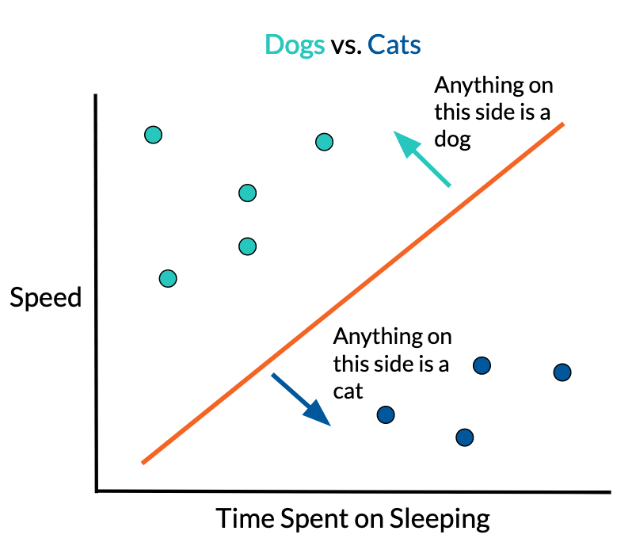
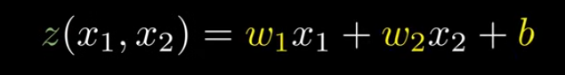
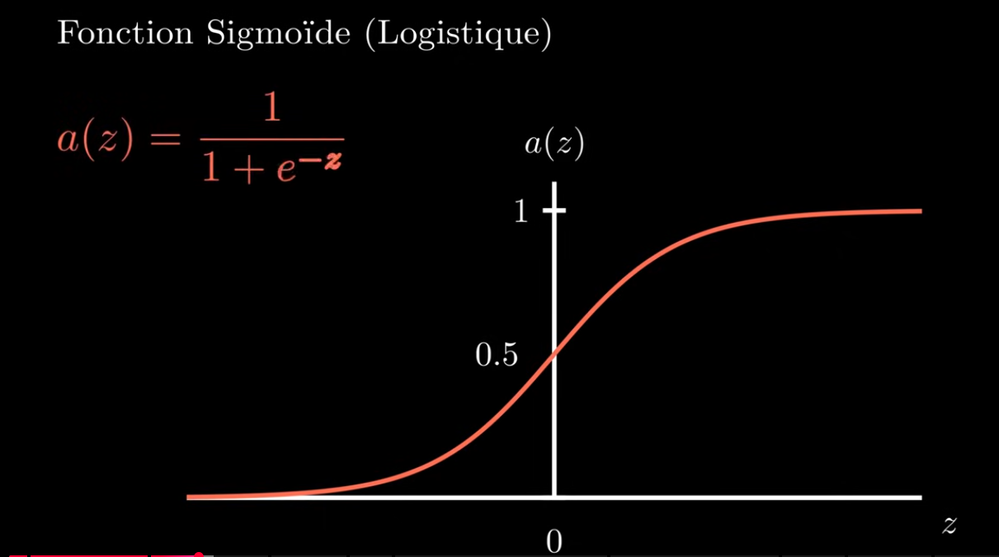
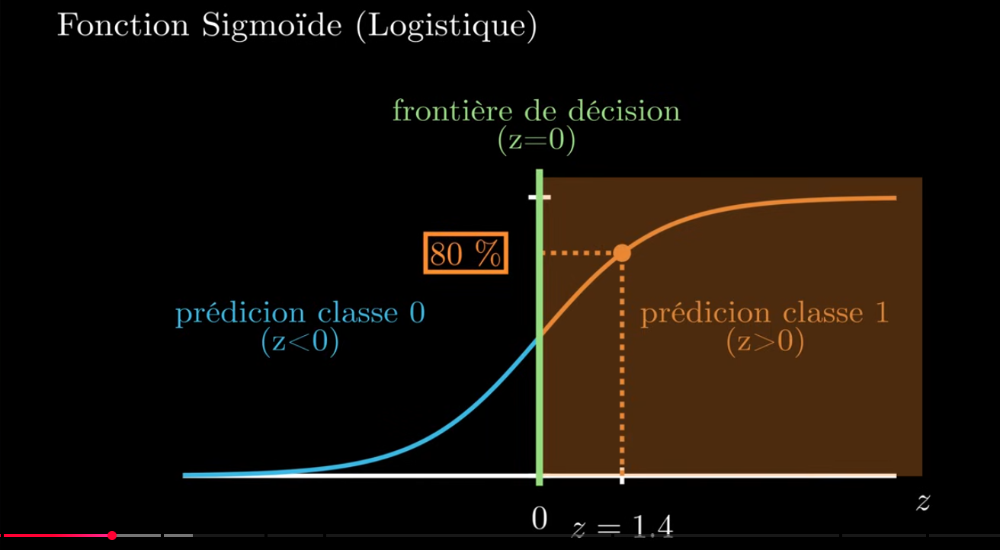
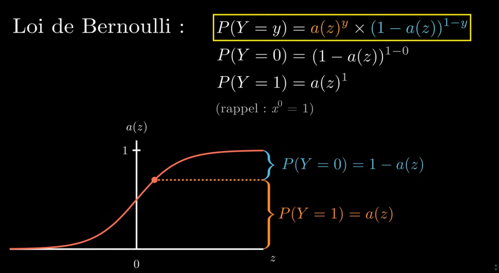
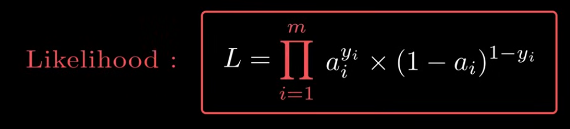
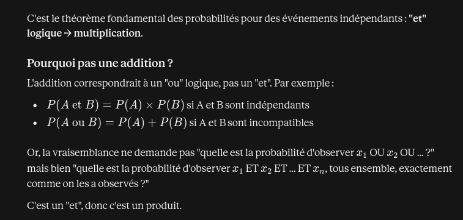
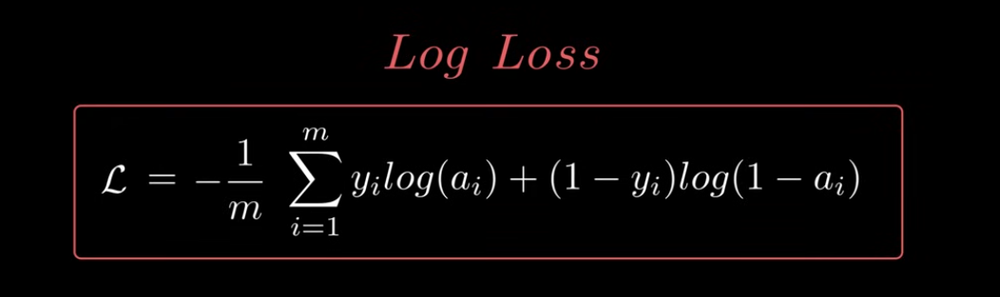
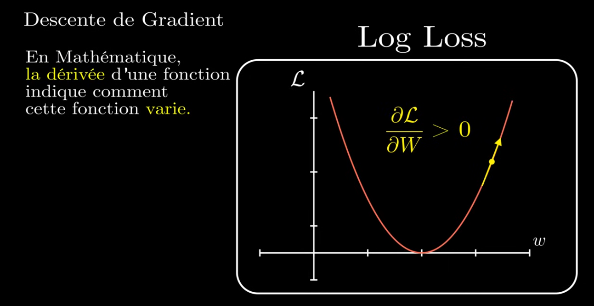
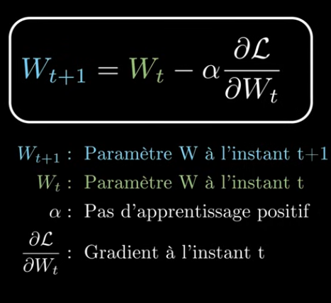

# 0 - Le perceptron

## Le Machine learning

On utilise un **algorithme d'optimisation** pour developper un **modele**: Il teste differentes valeurs jusqu'a obtenir la combinaison qui minimise la distance entre le modele et les donnees. (points)

### Deep learning

Au lieu d'une simple fonction on utilise un reseau de fonctions connectees les unes aux autres, c'est un reseau de neurones.
Plus il y a de fonctions, plus le reseau est profond et plus la machine peut realiser des taches complexes.

## Implementation d'un perceptron

Le perceptron est l'unite de base d'un reseau de neurone. Il separe lineairement deux classes de points par ce que l'on appelle la **frontiere de decision**.  

  

### Fonction d'activation

La fonction d'activation du perceptron est une **fonction sigmoide** (ou logistique). Cette fonction genere un resultat compris strictement entre 0 ou 1 (ces extremites representent les deux classes) et ou 0 est la frontiere de decision.  

On definit la probabilite qu'un point appartient a une classe par la **loi de Bernoulli**.  

### Fonction cout

La fonction de cout necessite un calcul de la vraisemblance.
La vraisemblance est la plausibilite du modele vis-a-vis des vraies donnees.
Plus la vraisemblance est elevee, plus le modele est proche de la realite.
Exemple : Si le resultat est proche de 100% cela veut dire que le modele est accord avec 100% des valeurs considerees comme vraies.  

Cette vraisemblance est obtenu en faisant le produit du resultat de la loi de Bernoulli.
  
*Pourquoi faire le produit des probabilites et non la somme?*  
  
Les probabilites se situant entre 0 et 1, plus il y a de valeurs, plus la vraisemblance va tendre vers 0.
Ce probleme peut etre contourne en usant de la fonction log : Elle permet de sortir les termes de la fonction pour faire la somme plutot que le produit tout en conservant l'ordre puisque c'est une fonction **monotone croissante**.
Par usage, nous allons **maximiser la vraisemblance en minimisant** la fonction *-log(L)*.

La division par le nombre de facteurs est facultatif mais permet de normaliser le resultat.

### La descente de gradient

Pour minimiser les erreurs du modele en ajustant les parametres, il faut determiner la facon dont cette fonction varie en calculant la **derivee** (ou gradient) de Log Loss.  

La descente de gradient n'est possible que sur une fonction **convexe** (ie elle ne contient qu'un seul minimum).
